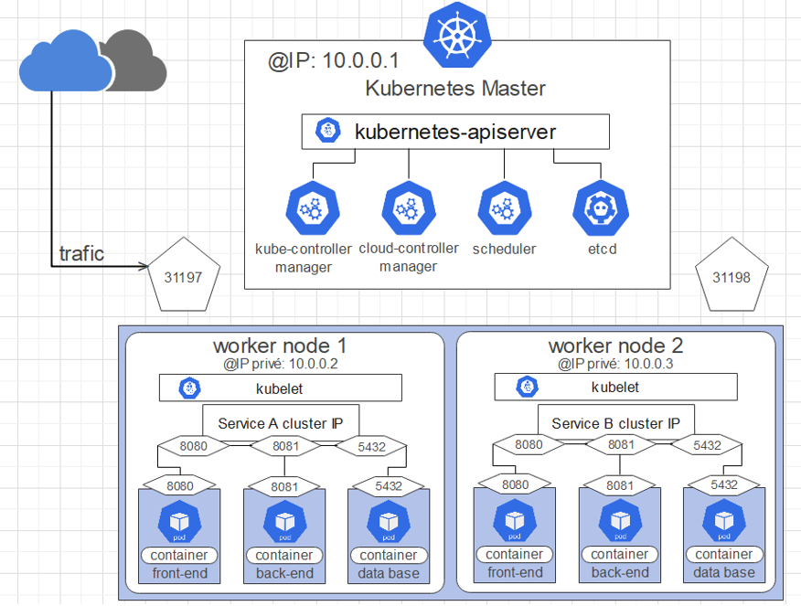

# Architecture du cluster : 

# K8s-cluster-with-Terraform
creation d un cluster Kubernetes local atomatiseé avec Terraform
dans ce projet on utilise le Terraform pour deployer localement sur notre machine local 

<h1>Requirements</h1>
<h2> Minikube Docker Terraform </h2>

$minikube start 

//pour ajouter des worker nodes pour le cluster : 
//$minikube node add 

$minikube status

on peut distinguer ca en docker desktop : 3 conteneur sont en cours : 1 master node et 2 workers 

pour deployer ces fichier sur le cluster il faut se placer sur le repo ou on les fichier :

#les etapes apres la creation du cluster  : 

<h3>Attention !</h3> :

il faut modifier le fichier provider.tf l adresse ip de cluster :

pour reccuper l adresse on fait ca : 

$terraform init 
$terraform plan 
$terraform aplly : yes 

$kubectl get deployments

$kubectl get svc 

$kubectl get pods

$minikube service webapp-sql

cette page s affiche sur le Browser et si ecrit hi dans le chat il nous repond  en se conectant au pod de la base de donnes mySQL

